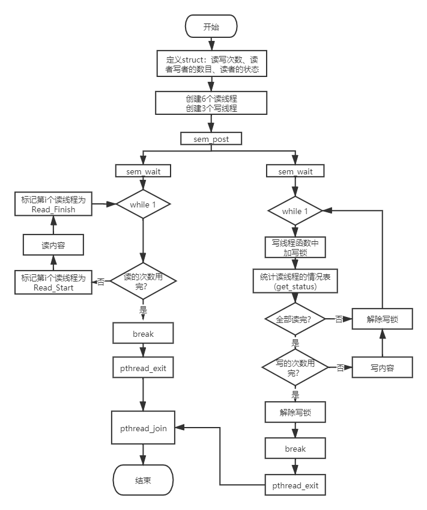
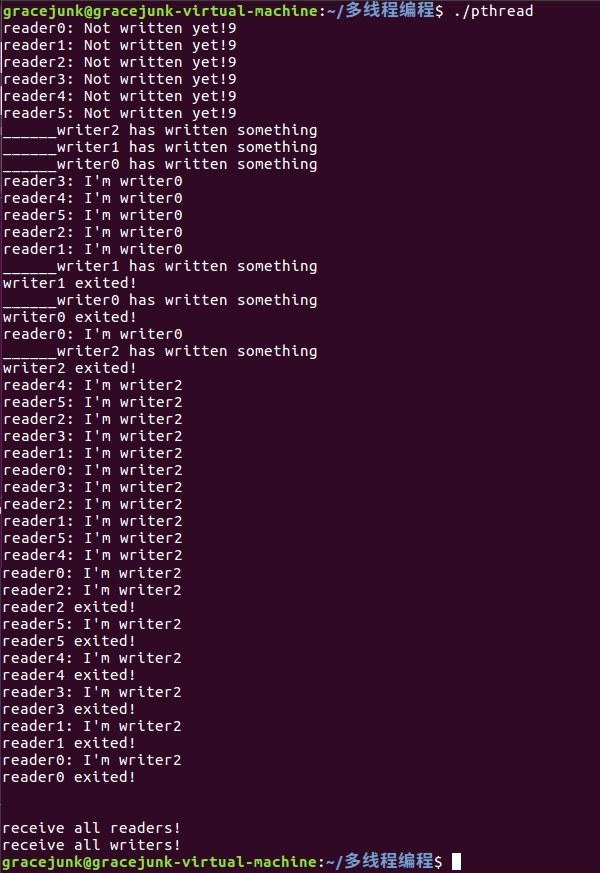

|       实验题⽬:    多线程编程          | 
| :-----------------------------------: |
|     **⼩组名称：    第五组**         |
| **小组成员：隆非非、卓佳佳、刘政** |
 


# 一、实验目的
* 掌握基于pthread线程库的多线程编程技术。
* 掌握基本的线程间同步技术(sem， mutex)。
* 理解共享资源并掌握其操作方法。


# 二、实验内容

### 读者-写者问题多线程实现
* 一个数据集（如数据、文件等）被N个线程读写；
* 一些线程只要求读数据集内容，称为读者 (Reader)，实验读者数不少于6个；
* 另些线程要求修改数据集内容，称为写者 (Writer)，实验写者数不少于3个；
* 多个读者可以同时读数据集内容，不需要互斥操作；
* 一个写者不能和其他写者或读者同时访问数据集，换句话说，写者和其他写者或读者之间必须互斥操作！
* 读者优先：如果有读者，写者需要等待！用于更新不频繁或更新影响不显著、读者较多的场合；
* 写者优先：如果有写者，读者需要等待！用于更新频繁或更新影响显著的场合。

# 三、实验过程与结果

### (1) 读优先场景线程描述流程图



### (2) 关键代码
#### 信号传递：

```
	    	sem_t * pSemrnw = sem_open(SEM_rnw, O_CREAT, 0666, 0); 
		sem_post(pSemrnw); 
		sem_wait(pSemrnw); 创建1个有名信号，等主线程创建完9个线程之后再发sem信号使其同时开始工作。
```
#### 读优先判断：
        	all_status = get_status(writer_rnw->read_status);
		if(6==all_status)
主要是用上述判断语句，等所有读者结束之后再进行写操作。

如果是写优先场景，也是一样，写者写操作时上互斥锁。先判断是否在写的状态，当不在写的状态时，读者进行读操作。
#### 互斥锁：		
	while(1)
	{
		pthread_mutex_lock(&(writer_rnw->writer_mutex));// 先抢锁，后判断状态；未抢到就一直抢
		
		all_status = get_status(writer_rnw->read_status);
		if(6==all_status)  // 都读完了，可以开始写
		{
			mystrcpy(writer_rnw->buf, words, write_num);
			printf("______writer%d has written something\n",write_num);
			mytimes_to_write--;
			if(0==mytimes_to_write)
			{
				pthread_mutex_unlock(&(writer_rnw->writer_mutex));// 解锁
				break;
			}
				
			
			pthread_mutex_unlock(&(writer_rnw->writer_mutex));// 写后，解锁
			
			usleep(WRITE_USLEEP); // 写一次后休眠较长时间，等待其他写操作
		}
		else
		{
			pthread_mutex_unlock(&(writer_rnw->writer_mutex));// 不能写，也要解锁
			usleep(TRY_WRITE_USLEEP);
		}
	}

### (3) 实验结果截图




# 四、实验总结
### 实验收获

* 掌握了基于pthread线程库的多线程编程技术。
* 掌握了基本的线程间同步技术(sem，mutex)。
* 理解了共享资源并掌握其操作方法。

### 未解决的问题

读写不够灵活，不能随机需要指定。

# 五、附实验源码
```
#include<stdio.h>
#include<unistd.h>
#include<stdlib.h>
#include<string.h>
#include<pthread.h>
#include<semaphore.h>
#include<fcntl.h> 

#define READ_START  0				// 0 读线程开始读， 禁止写操作
#define READ_FINIFH 1				// 1 读进程结束，可以写
#define MAX_TO_READ	5				// 每个写进程最多写次
#define MAX_TO_WRITE 2				// 每个读进程最多读次
#define READ_USLEEP		1000		// 读进程读取后休眠时间
#define WRITE_USLEEP	1500		// 写进程写入后休眠时间
#define TRY_WRITE_USLEEP	5		// 在未写入时，每个写进程读取读线程状态的刷新时间

#define SEM_rnw "begin_to_readandwrite" // 用于控制读写线程预处理后同步进行

void *mywriter(void *args);			// 写线程函数
void *myreader(void *args);			// 读线程函数
int get_status(int *status);		// 获取所有读线程状态
int mystrcpy(char *tar, const char *src, int num); // 写线程使用的字符串复制函数

typedef struct rnw_t{
	int result_read[6];  	// 6个读线程创建返回值
	int result_write[3];  	// 3个写线程创建返回值
	int read_num;			// 第num个读线程
	int write_num;			// 第num个写线程
	int times_to_write;		// 每个写线程最多写的次数
	int times_to_read;		// 每个写线程最多读的次数
	
	int read_status[6];
	char buf[128];			// 读写用的buf
	
	pthread_mutex_t writer_mutex;  //写线程用的互斥锁
}Rnw;


int main()
{
	pthread_t pt_read[6],pt_write[3];
	Rnw *rnw = (Rnw *)malloc(sizeof(Rnw));
	rnw->times_to_write = MAX_TO_WRITE;  		// 每个写线程最多写次
	rnw->times_to_read = MAX_TO_READ;			// 每个读线程最多读次
	memset(rnw->read_status,0,6);		
	memset(rnw->buf,0,128);	
	int i,all_status,start_to_rnw = 0;
	
	mystrcpy(rnw->buf, "Not written yet!", 9);
	pthread_mutex_init(&rnw->writer_mutex, NULL);
	sem_t * pSemrnw = sem_open(SEM_rnw, O_CREAT, 0666, 0); 
	
	
	for(i=0;i<6;i++) 		// 创建6个读线程
	{
		rnw->read_num = i; // 标记当前读线程编号
		rnw->result_read[i]= pthread_create(&(pt_read[i]), NULL,(void *)myreader, (void*)rnw);
		if(rnw->result_read[i] != 0)
		{
			printf("create pthread error!\n");
			exit(-1);
		}
		usleep(100); //挂起主线程，使创建的线程运行，获取编号
	}
	for(i=0;i<3;i++) // 创建3个写进程
	{
		rnw->write_num = i; // 标记当前写线程编号
		rnw->result_write[i]= pthread_create(&(pt_write[i]), NULL, (void *)mywriter, (void*)rnw);
		if(rnw->result_write[i] != 0)
		{
			printf("create pthread error!\n");
			exit(-1);
		}	
		usleep(100); //挂起主线程，使创建的线程运行，获取编号
	}
	
	// 使所有读写线程在此时开始执行循环,start to read and write
	for(i=0;i<9;i++)
		sem_post(pSemrnw); 

	
	// 读写线程已结束
	for(i=0;i<6;i++)  // 回收6个读线程
	{
		pthread_join(pt_read[i], NULL);
	}
	printf("\n\n");
	printf("receive all readers!\n");
	
	for(i=0;i<3;i++) // 回收3个写进程
	{
		pthread_join(pt_write[i], NULL);
	}
	printf("receive all writers!\n");
	
	return 0;
}
//*********************************读线程******************
void *myreader(void *args)
{
	Rnw *reader_rnw = (Rnw *)args;
	int mytimes_to_read = reader_rnw->times_to_read;
	int read_num = reader_rnw->read_num; //获得自身线程编号；
	sem_t * pSemrnw = sem_open(SEM_rnw, O_CREAT, 0666, 0); 
	
	sem_wait(pSemrnw); 
	while(1)
	{
		reader_rnw->read_status[read_num] = READ_START;  //开始读，写操作被禁止
		
		printf("reader%d: %s\n",read_num,reader_rnw->buf);
		mytimes_to_read--;
		if(0==mytimes_to_read)
		{
			reader_rnw->read_status[read_num] = READ_FINIFH;
			break;
		}
		
		reader_rnw->read_status[read_num] = READ_FINIFH;//已读，可进行写操作
		
		usleep(READ_USLEEP); 
	}
	printf("reader%d exited!\n",read_num);
	pthread_exit(" exited!\n"); // 退出时说明自身是第几个读线程
	
	return (void *)NULL;
}
//*********************************写线程******************
void *mywriter(void *args)
{
	Rnw *writer_rnw = (Rnw *)args;
	int mytimes_to_write = writer_rnw->times_to_write;
	int write_num = writer_rnw->write_num; //获得自身线程编号；但可能被覆盖？
	int all_status; // 统计读线程情况
	char *words = "I'm writer";
	sem_t * pSemrnw = sem_open(SEM_rnw, O_CREAT, 0666, 0); 
	
	sem_wait(pSemrnw); 
	while(1)
	{
		pthread_mutex_lock(&(writer_rnw->writer_mutex));// 先抢锁，后判断状态；未抢到就一直抢
		
		all_status = get_status(writer_rnw->read_status);
		if(6==all_status)  // 都读完了，可以开始写
		{
			mystrcpy(writer_rnw->buf, words, write_num);
			printf("______writer%d has written something\n",write_num);
			mytimes_to_write--;
			if(0==mytimes_to_write)
			{
				pthread_mutex_unlock(&(writer_rnw->writer_mutex));// 解锁
				break;
			}
				
			
			pthread_mutex_unlock(&(writer_rnw->writer_mutex));// 写后，解锁
			
			usleep(WRITE_USLEEP); // 写一次后休眠较长时间，等待其他写操作
		}
		else
		{
			pthread_mutex_unlock(&(writer_rnw->writer_mutex));// 不能写，也要解锁
			usleep(TRY_WRITE_USLEEP);
		}
	}
	printf("writer%d exited!\n",write_num);
	pthread_exit(" exited!\n");// 退出时说明自身是第几个写线程
	
	return (void *)NULL;
}

int get_status(int *status)
{
	int i,ret=0;
	int *q = status;
	for(i=0;i<6;i++)
		ret += q[i];

	return ret;
}

// 将src的内容附加num信息后，写入tar
int mystrcpy(char *tar, const char *src, int num)
{
	int i = 0;
	while(0 != src[i])
	{
		
		tar[i] = src[i];
		i++;
	}
	// 在末尾追加数字信息
	tar[i] = 48 + (char)num; // 将数字转换为字符0-9
	i++;
	tar[i] = 0;// 置结束符
	
	return 0;
}


```


